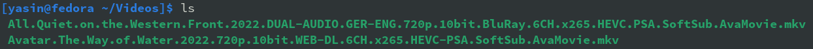
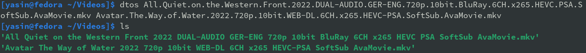

# Bash Script for Renaming Files with Dots to Spaces

This *simple* Bash script is designed to rename files with dots in their names to spaces, while preserving the file extension. It can be useful for batch-renaming files that have been named using periods as separators, such as video files with names like 

##### before dtos-ing :(

##### after dtos-ing :)
## How to Use

1. Download the script to your local machine.
2. Make the script executable using the command `chmod +x dtos`.
3. Navigate to the directory containing the files you want to rename.
4. Run the script using the command `./dtos`.

The script gets files in the current directory as command-line arguments, and rename each file according to the following rules:

1. If the file does not have an extension, it will be skipped.
2. The dots in the filename will be replaced with spaces.
3. The file extension will be preserved.

For example, a file named `my.video.file.mkv` will be renamed to `my video file.mkv` *with this command :*

**./dtos  'my.video.file.mkv'**

## PLEAS ATTENTION : only use this script with linux filesystem, btrfs or Ext4 ..., using this script for your external storage that doesn't have linux filesystem, which is very common, because most of them use NTFS, will cost you damage some of your files and may lost them permanently.

# stod

There is also a reverse script for it, that exactly does the opposite job.

<<<<<<< HEAD
check out [stod](https://github.com/Yasin1ar/dtos/stod) if you want to change your spaces to dot again.
=======
check out [stod](https://github.com/Yasin1ar/dtos/tree/main/stod) script in stod directory if you want to change your spaces to dot again.
>>>>>>> 286626166cc1bc69f606d6815462e1ee27d66820
